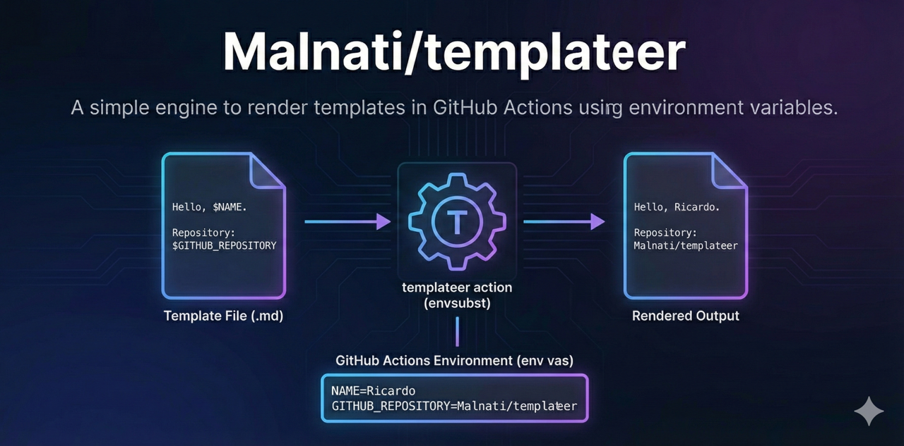
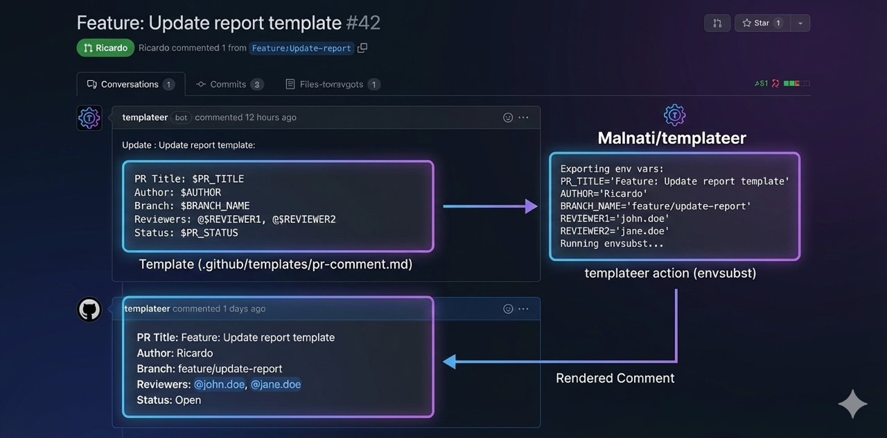

<!-- README.md -->
<h1 align="center">Malnati/templateer</h1>

  <b>A simple engine to render templates in GitHub Actions using environment variables.</b>

  
  
  

<h2>What it is</h2>

  

  <b>Templateer</b> is a GitHub <i>composite action</i> that renders template files using
  <code>envsubst</code> based on environment variables available in the GitHub Actions step/job.

<ul>
  <li>Accepts <code>template</code> and <code>result</code></li>
  <li>Optionally prints exported variables via <code>debug=true</code></li>
  <li>Produces outputs: <code>path</code> and <code>body</code></li>
</ul>

<h2>How it works</h2>

<ol>
  <li>Exports environment variables to <code>$GITHUB_ENV</code> (except those starting with <code>GITHUB_</code>)</li>
  <li>Runs <code>envsubst</code> to replace placeholders (e.g., <code>$VAR</code>) in the template</li>
  <li>Publishes the rendered file path and rendered content as outputs</li>
</ol>

  

<h2>Inputs</h2>

<table>
  <thead>
    <tr>
      <th>Input</th>
      <th>Required</th>
      <th>Default</th>
      <th>Description</th>
    </tr>
  </thead>
  <tbody>
    <tr>
      <td><code>template</code></td>
      <td>Yes</td>
      <td>-</td>
      <td>Template file path</td>
    </tr>
    <tr>
      <td><code>result</code></td>
      <td>Yes</td>
      <td>-</td>
      <td>Rendered output file path</td>
    </tr>
    <tr>
      <td><code>debug</code></td>
      <td>No</td>
      <td><code>false</code></td>
      <td>If <code>true</code>, prints exported variables to logs</td>
    </tr>
  </tbody>
</table>

<h2>Outputs</h2>

<table>
  <thead>
    <tr>
      <th>Output</th>
      <th>Description</th>
    </tr>
  </thead>
  <tbody>
    <tr>
      <td><code>path</code></td>
      <td>Rendered file path</td>
    </tr>
    <tr>
      <td><code>body</code></td>
      <td>Rendered content (multiline)</td>
    </tr>
  </tbody>
</table>

<h2>Usage example</h2>

<h3>1) Template</h3>

<pre><code># .github/templates/report.md
Hello, $NAME.

File: $FILE_NAME
Repository: $GITHUB_REPOSITORY
</code></pre>

<h3>2) Workflow</h3>

<pre><code># .github/workflows/example.yml
name: templateer-example

on:
  workflow_dispatch:

jobs:
  render:
    runs-on: ubuntu-latest
    steps:
      - uses: actions/checkout@v4

      - name: Render template
        id: tpl
        uses: Malnati/templateer@v1.0.0
        env:
          NAME: Ricardo
          FILE_NAME: .reports/20251215-0100_hardcode.json
        with:
          template: .github/templates/report.md
          result: /tmp/report.rendered.md

      - name: Print path
        shell: bash
        run: echo "${{ steps.tpl.outputs.path }}"

      - name: Print content
        shell: bash
        run: |
          echo "-----"
          echo "${{ steps.tpl.outputs.body }}"
          echo "-----"
</code></pre>

<h2>Template rules</h2>

<ul>
  <li>Use placeholders in the <code>$VAR</code> format (standard <code>envsubst</code> syntax).</li>
  <li>Variables can come from <code>env:</code> at the step/job level, or from previous steps via <code>$GITHUB_ENV</code>.</li>
</ul>

<h2>Limitations</h2>

<ul>
  <li><code>envsubst</code> only replaces environment variables; it does not support conditional logic.</li>
  <li>If a variable does not exist, the placeholder may become empty in the rendered output.</li>
</ul>

<h2>License</h2>

  See <a href="https://github.com/Malnati/templateer/blob/main/LICENSE">LICENSE</a>.

